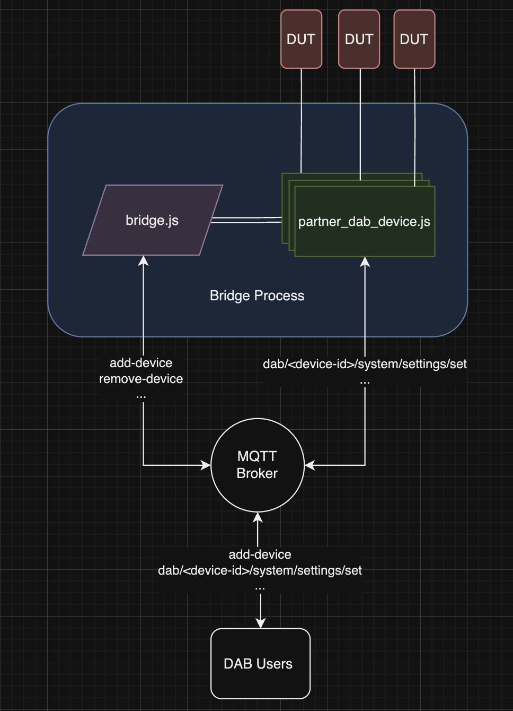

# DAB Bridge SDK

This project is a reference template that can be used to develop a DAB Bridge that is compliant with the DAB specification.

More details on the general usage for DAB Bridges can be found in the DAB User Guide.

## Structure Overview

This bridge is split into two primary components:

- Bridge Specific Components
- Partner DAB Operations Implementation

This bridge is designed such that a DAB Partner only needs to fill in their implementation of various DAB operations.

The MQTT5 request-response model, parsing parameters, routing to appropriate files, multiple device management, and other boiler-plate code is already implemented within the bridge specific components.

The partner specific implementation component is located under `src/partner/`. A sample `PartnerDabDevice` implementation has been started for you.

Here is a brief visualization of how the bridge works end-to-end. Details can be found in comments throughout the source code.



## Implementation Steps

1. Fork or clone this repository
2. Install all dependencies with `npm install`
3. Navigate to `src/partner/`
4. Implement each DAB operation within each file as per the specification. MQTT input parsing and output delivery is already handled by the bridge. Simply use the parameters that comes through the `data` parameter of each function, and return responses as expected.
5. Run the DAB Bridge with your device target implementation using `node src/index.js`
6. Onboard your real device using the device management operations specified below and begin using DAB operations.

Run sanity unit tests using `npm run test`, and use the Compliance Suite tool to run tests end-to-end with the device.

## CLI Parameters

```
❯ node index.js --help
DAB JS Bridge
Usage: index [options]

Options:
  -i, --bridgeID <string>  The bridge-id on the network. Generates a random bridge-id string if
                           blank. Example: -i myPartnerBridgeName (Optional) 
                           
  -b, --brokerURI <string> The URI of the MQTT broker. Defaults to mqtt://localhost:1883 if blank.
                           Example: -b http://192.168.1.123 (Optional) 
                           
  -h, --help               Display help for command
```

### Examples

In these examples, we specify the response topic as `my/response/topic`.

Install `mosquitto_pub` to act as an DAB user client.

### Onboard a device to the bridge

When you onboard a device to the Bridge, your implementation / extension of `DabDeviceInterface` will be instantiated and stored.
There can be multiple instances of your implementation, but the Bridge is responsible for managing these. 

If you know the IP of your board on your local network, add it directly to the bridge, using `mosquitto_pub` :

```
$ mosquitto_pub -t dab/bridge/<bridge-name>/add-device -m '{ "ip": "<device-ip>" }' -D publish response-topic "my/response/topic"
```

The result will be published in `my/response/topic`.

```
{
    "status": 200,
    "deviceId": <dab-device-id> // Uniquely generated ID for the added device, use this for any DAB operations moving forward
}
```

### Removing a device from the bridge

To remove a device from the bridge with `mosquitto_pub` :

```
$ mosquitto_pub -t dab/bridge/<bridge-name>/remove-device -m '{ "ip": "<device-ip>" }' -D publish response-topic "my/response/topic"
```

The result will be published in `my/response/topic`.

### List all devices connected to the bridge

```
$ mosquitto_pub -t dab/bridge/<bridge-name>/list-devices -m '{}' -D publish response-topic "my/response/topic"
```

Assuming the unique device ID of our device in this example is `device0`.

### Sending DAB Commands

Given the DAB deviceID of our example (`device0`), send DAB commands like so:

#### Do a health check

```
mosquitto_pub -t dab/device0/health-check/get -m '{}' -D publish response-topic "my/response/topic"
```

#### List applications on a device

```
mosquitto_pub -t dab/device0/applications/list -m '{}' -D publish response-topic "my/response/topic"
```

#### Start an application on a device

```
mosquitto_pub -t dab/device0/applications/launch -m '{ "appId": "Cobalt" }' -D publish response-topic "my/response/topic"
```

#### List system settings that are available to configure on a device 

```
mosquitto_pub -t dab/device0/system/settings/list -m '{}' -D publish response-topic "my/response/topic"
```

